# AI Agent Prompt Templates & Workflow System

A collection of specialized system prompt templates and workflow documentation for creating AI-powered software development orchestration systems, specifically designed for CRM/CMS automation projects.

## Table of Contents

- [Overview](#overview)
- [Contents](#contents)
- [Agent Prompt Templates](#agent-prompt-templates)
- [Workflow Implementation](#workflow-implementation)
- [Usage](#usage)
- [System Architecture](#system-architecture)
- [Phase-Based Development Process](#phase-based-development-process)
- [Customization](#customization)
- [Implementation Guide](#implementation-guide)
- [Contributing](#contributing)

## Overview

This repository contains carefully crafted system prompt templates for **7 specialized AI agents** that work together in a structured **4-phase workflow** to automate the complete software development lifecycle. Each template is designed to create agents with specific expertise areas, from initial brainstorming to production optimization, while maintaining human oversight at critical decision points.

**Target Use Case**: CRM/CMS automation projects requiring Clean Architecture principles and structured development processes with iterative requirements refinement.

## Contents

### Prompt Template Files
```
├── brainstorming-agent.md           # Creative solution exploration agent
├── requirements-architect.md        # Business-to-technical translation agent  
├── system-design-agent.md          # Clean Architecture design agent
├── implementation-planner.md       # Sprint strategy and resource planning agent
├── code-architect-agent.md         # Clean Architecture scaffold generation agent
├── qa-agent.md                     # Quality assurance and testing agent
├── optimization-analyst.md         # Performance and improvement analysis agent
└── workflow-diagram.mmd            # Mermaid flowchart of complete process
```

### Supporting Documentation
- **4-phase workflow diagram**: Visual representation of agent interactions across development phases
- **Iterative scoping process**: Initial requirements-brainstorming refinement cycle
- **Human checkpoint definitions**: Guidelines for strategic decision points
- **Clean Architecture principles**: Embedded architectural standards

## Agent Prompt Templates

Each prompt template is designed for specific AI model integration (optimized for Gemini 2.5 Pro) and includes:

| Template | Purpose | Phase | Key Features |
|----------|---------|-------|--------------|
| **Brainstorming Agent** | Solution exploration & technology evaluation | Phase 1 | Multi-approach analysis, feasibility assessment, creative problem-solving |
| **Requirements Architect** | Business requirements to technical specifications | Phase 1 | Risk assessment, success criteria definition, stakeholder communication |
| **System Design Agent** | Clean Architecture blueprint creation | Phase 2 | SOLID principles, API contracts, scalability patterns |
| **Implementation Planner** | Sprint strategy & resource allocation | Phase 2 | Timeline optimization, team coordination, dependency management |
| **Code Architect Agent** | Clean Architecture scaffold generation | Phase 3 | Service skeletons, SOLID implementation, test harness creation |
| **QA Agent** | Automated testing & validation | Phase 3 | Test suite generation, architectural compliance, quality gates |
| **Optimization Analyst** | Performance analysis & improvements | Phase 4 | Production metrics review, technical debt assessment |

### Template Structure

Each prompt template contains:
- **Role definition** with specific expertise areas
- **Input/output specifications** for agent communication
- **Tool integration guidelines** (code generation, web search, analysis)
- **Reasoning patterns** (Chain-of-Thought, Tree-of-Thought)
- **Quality validation criteria**
- **Human checkpoint preparation** instructions

## Workflow Implementation

The templates implement a **4-phase structured workflow** with **8 human checkpoints** for strategic oversight, including an **iterative initial scoping process**:

## System Architecture

The framework processes projects through a sophisticated 4-phase pipeline with iterative requirements refinement and strategic human oversight:

```mermaid
flowchart TD
    %% Phase 1: Initial Scoping
    subgraph P1 ["Phase 1: Initial Scoping"]
        direction TB
        H0[Human: Project Intake<br/>Initial requirement assessment]
        H0_REQ[Human: Requirements Review<br/>Validate initial technical specs]
        H0_BRAIN[Human: Solution Validation<br/>Approve brainstormed approaches]
        REQ[Requirements Architect Agent<br/>Translates business needs to technical specs]
        BRAIN[Brainstorming Agent<br/>Explores solution approaches & possibilities]
    end
    
    %% Phase 2: System Design
    subgraph P2 ["Phase 2: System Design"]
        direction TB
        H1[Human: Requirements & Approach Validated<br/>Final technical specs & approach approved]
        SYS[System Design Agent<br/>Creates architecture & integration patterns]
        PLAN[Implementation Planner Agent<br/>Decomposes design into development strategy]
        H3[Human: Architecture Review<br/>Confirm system approach]
        H4[Human: Resource Approval<br/>Authorize implementation plan]
    end
    
    %% Phase 3: Execution
    subgraph P3 ["Phase 3: Execution"]
        direction TB
        CODE[Code Architect Agent<br/>Generates service skeletons & implementations]
        QA[Quality Assurance Agent<br/>Designs testing strategy & validation]
        H5[Human: Code Review<br/>Quality gate approval]
        H6[Human: Handoff Decision<br/>Ready for DevOps team]
    end
    
    %% Phase 4: Hand-off & Monitoring
    subgraph P4 ["Phase 4: Hand-off & Monitoring"]
        direction TB
        OPT[Optimization Analyst Agent<br/>Analyzes performance & improvements]
        H7[Human: Strategic Alignment<br/>Continuous oversight]
    end
    
    %% External Handoff (Outside phases)
    EXT[External DevOps/Infra Team<br/>Deployment & production management]
    
    %% Phase 1 Internal Flow
    H0 -->|Project requirements<br/>Business context<br/>Initial constraints| REQ
    REQ -->|Initial requirements draft<br/>Technical interpretation<br/>Clarification needs| H0_REQ
    H0_REQ -->|Refine requirements| REQ
    H0_REQ -->|Requirements ready<br/>Begin solution exploration| BRAIN
    BRAIN -->|Solution approaches<br/>Technology options<br/>Feasibility analysis| H0_BRAIN
    H0_BRAIN -->|Need requirement changes| REQ
    H0_BRAIN -->|Refine solutions| BRAIN
    
    %% Phase 2 Internal Flow
    SYS -->|System architecture<br/>API contracts<br/>Integration design| H3
    H3 -->|Validated architecture<br/>Technical decisions| PLAN
    PLAN -->|Development tasks<br/>Resource allocation<br/>Timeline strategy| H4
    
    %% Phase 3 Internal Flow
    CODE -->|Service implementations<br/>Database schemas<br/>Business logic| QA
    QA -->|Test results<br/>Quality metrics<br/>Validation report| H5
    H5 -->|Quality approved code<br/>Documentation<br/>Deployment specs| H6
    
    %% Phase 4 Internal Flow
    OPT -->|Performance analysis<br/>Improvement recommendations<br/>Knowledge updates| H7
    
    %% Cross-Phase Connections
    H0_BRAIN -->|Solutions validated<br/>Ready for selection| H1
    H1 -->|Selected approach<br/>Technical direction<br/>Scope System Design| SYS
    H4 -->|Approved plan<br/>Team assignments| CODE
    H6 -->|Production-ready code<br/>Deployment requirements<br/>Technical documentation| EXT
    EXT -->|Production system<br/>Performance data<br/>User feedback| OPT
    
    %% Feedback Loops
    H7 -->|Strategic adjustments<br/>process improvements| H0
    OPT -->|Technical insights<br/>Architecture learnings| SYS
    OPT -->|Process optimizations<br/>Resource insights| PLAN
    
    %% Parallel Processing Connections
    BRAIN -.->|Solution context| SYS
    SYS -.->|Architecture context| CODE
    PLAN -.->|Implementation context| QA
    
    %% Styling
    classDef agent fill:#e1f5fe,stroke:#01579b,stroke-width:2px
    classDef human fill:#fff3e0,stroke:#ef6c00,stroke-width:3px
    classDef iterative fill:#e8f5e8,stroke:#2e7d32,stroke-width:3px
    classDef external fill:#f3e5f5,stroke:#4a148c,stroke-width:2px
    classDef feedback stroke-dasharray: 5 5
    
    class BRAIN,REQ,SYS,PLAN,CODE,QA,OPT agent
    class H0,H1,H3,H4,H5,H6,H7 human
    class H0_REQ,H0_BRAIN iterative
    class EXT external
    
    %% Phase Styling
    classDef phaseBox fill:#f9f9f9,stroke:#333,stroke-width:2px
    class P1,P2,P3,P4 phaseBox
```



## Phase-Based Development Process

### **Phase 1: Initial Scoping** 
*Iterative Requirements & Solution Discovery*

**Objective**: Achieve alignment on project requirements and technical approach through iterative refinement.

**Key Features**:
- **Iterative Requirements Cycle**: Human → Requirements Architect → Human validation with refinement loops
- **Solution Exploration Cycle**: Requirements → Brainstorming Agent → Human validation with solution refinement
- **Flexible Navigation**: Human oversight can route between requirements and brainstorming based on project needs
- **Quality Gates**: Multiple validation checkpoints before committing to final approach

**Participants**: H0 (Project Intake), H0_REQ (Requirements Review), H0_BRAIN (Solution Validation), Requirements Architect Agent, Brainstorming Agent

### **Phase 2: System Design**
*Architecture & Implementation Planning*

**Objective**: Transform validated requirements and approach into detailed system architecture and development strategy.

**Key Features**:
- **Clean Architecture Blueprint**: System Design Agent creates SOLID-compliant architectures
- **Implementation Strategy**: Implementation Planner decomposes design into executable development tasks
- **Resource Allocation**: Strategic planning for team assignments and timeline optimization
- **Architecture Validation**: Human oversight ensures technical feasibility and business alignment

**Participants**: H1 (Requirements & Approach Validated), System Design Agent, Implementation Planner Agent, H3 (Architecture Review), H4 (Resource Approval)

### **Phase 3: Execution**
*Code Generation & Quality Assurance*

**Objective**: Generate production-ready code scaffolds with comprehensive testing strategy.

**Key Features**:
- **Clean Architecture Scaffolding**: Code Architect Agent generates service skeletons and business logic
- **Automated Testing Strategy**: QA Agent designs comprehensive test suites and validation frameworks
- **Quality Gates**: Human code review ensures architectural compliance and quality standards
- **Deployment Readiness**: Preparation for external DevOps handoff

**Participants**: Code Architect Agent, QA Agent, H5 (Code Review), H6 (Handoff Decision)

### **Phase 4: Hand-off & Monitoring**
*Production Optimization & Strategic Oversight*

**Objective**: Continuous performance optimization and strategic process improvement.

**Key Features**:
- **Performance Analysis**: Optimization Analyst reviews production metrics and user feedback
- **Improvement Recommendations**: Technical debt assessment and optimization suggestions
- **Strategic Alignment**: Human oversight for organizational goal alignment and process improvements
- **Feedback Integration**: Insights fed back to earlier phases for continuous improvement

**Participants**: Optimization Analyst Agent, H7 (Strategic Alignment), External DevOps Team

### **Cross-Phase Integration**

- **Context Sharing**: Parallel processing connections preserve knowledge across phases
- **Feedback Loops**: Strategic insights from Phase 4 inform future Phase 1 iterations
- **Quality Continuity**: Architectural decisions propagate from design through execution
- **Human Oversight**: Strategic checkpoints at every critical transition point

## Usage

### Setting Up Your AI Orchestration System

1. **Choose your AI platform** (templates optimized for Gemini 2.5 Pro, adaptable to others)

2. **Deploy agent instances** using the provided prompt templates:
```bash
# Example: Configure Requirements Architect Agent for Phase 1
cp requirements-architect.md your-ai-platform/agents/requirements-prompt.txt
```

3. **Configure phase-based workflow orchestration**:
   - Set up iterative loops within Phase 1 (Initial Scoping)
   - Implement human checkpoint integration at phase transitions
   - Configure context sharing between agents across phases

4. **Customize for your domain**:
   - Modify templates for specific technology stacks
   - Adjust phase transition criteria
   - Integrate with existing development tools

### Running a Project Through the 4-Phase Workflow

1. **Phase 1 Entry**: Human provides project requirements (H0)
2. **Iterative Scoping**: Requirements and brainstorming agents refine specifications with human validation
3. **Phase Transitions**: Strategic human decisions at each phase boundary (H1, H4, H6)
4. **Cross-Phase Context**: Agents share relevant knowledge for downstream processing
5. **Continuous Feedback**: Phase 4 insights improve future Phase 1 iterations

## Agent Communication Protocol

The templates implement structured agent communication:
- **Phase-aware handoffs** with clear stage transitions
- **Context preservation** across phase boundaries
- **Quality validation** before human checkpoint presentations
- **Decision support materials** for strategic reviews

## Human-in-the-Loop Integration

Each template includes instructions for:
- **Phase-specific decision points** aligned with development workflow
- **Iterative validation cycles** within Phase 1 for requirements refinement
- **Executive summary generation** for strategic checkpoint reviews
- **Cross-phase feedback integration** for continuous improvement

## Clean Architecture Emphasis

All templates embed Clean Architecture principles:
- **SOLID compliance** throughout all phases
- **Domain-driven design** patterns in system architecture
- **Dependency inversion** for testability and maintainability
- **Hexagonal architecture** with ports and adapters

## Customization

### Adapting Templates for Different Domains

1. **Technology Stack Modification**:
   - Update tool references in prompt templates
   - Modify architectural patterns for your stack
   - Adjust phase-specific validation criteria

2. **Industry-Specific Customization**:
   - Add domain expertise to agent roles
   - Include industry compliance requirements in relevant phases
   - Modify quality gates for specific standards

3. **Organization Integration**:
   - Align human checkpoints with approval processes
   - Integrate with existing development workflows
   - Customize phase transition criteria

### Template Modification Guidelines

- **Preserve phase structure** while adding domain specifics
- **Maintain iterative Phase 1 cycles** for requirements refinement
- **Keep cross-phase context sharing** intact
- **Test complete workflow coherence** after modifications

## Implementation Guide

### Step 1: AI Platform Integration

Choose and configure your AI platform:
- **Gemini 2.5 Pro** (recommended, templates optimized)
- **GPT-4** (requires minor prompt adaptations)
- **Claude** (requires communication protocol adjustments)

### Step 2: Phase-Based Workflow Orchestration

Implement the 4-phase agent workflow:
- Set up iterative loops within Phase 1
- Create phase transition mechanisms
- Configure cross-phase context storage and retrieval
- Implement strategic feedback loop mechanisms

### Step 3: Human Interface Design

Create interfaces for phase-specific human checkpoints:
- **Phase 1**: Iterative requirement and solution validation dashboards
- **Phase 2**: Architecture review and resource approval interfaces
- **Phase 3**: Code review and deployment readiness workflows
- **Phase 4**: Strategic alignment and continuous improvement dashboards

### Step 4: Integration Testing

Validate the complete system:
- **End-to-end phase workflow** execution
- **Iterative Phase 1 cycles** functionality
- **Cross-phase context preservation** verification
- **Strategic feedback loops** validation

## Development Workflow

### Creating Custom Agents

Use the existing templates as patterns:
1. Define agent specialization and target phase
2. Specify input/output contracts within phase context
3. Include phase-appropriate tool integration requirements
4. Add human checkpoint preparation instructions
5. Test integration with phase-based workflow

### Extending the Workflow

To add new phases or modify existing ones:
1. Analyze phase insertion points in the workflow
2. Update the mermaid diagram with new phase subgraphs
3. Create new prompt templates for phase-specific agents
4. Define new human checkpoints if needed
5. Update cross-phase context-sharing protocols

## Contributing

### Template Improvement

- **Phase-specific enhancements** to agent roles
- **Iterative process optimization** for Phase 1 refinement cycles
- **Cross-phase integration** improvements
- **Human checkpoint** usability enhancements

### Documentation Updates

- **Phase-based implementation** examples for different platforms
- **Iterative workflow customization** guides for specific industries
- **Best practices** documentation for phase transitions
- **Troubleshooting guides** for complex workflow scenarios

### Quality Standards

- Test all template modifications across complete phase workflow
- Maintain iterative Phase 1 functionality
- Follow Clean Architecture principles in recommendations
- Document phase-specific changes with clear rationale

## Support & Community

- **Implementation Questions**: Create issues for phase-based setup guidance
- **Template Improvements**: Submit pull requests with phase-aware enhancements
- **Workflow Modifications**: Share custom phase adaptations
- **Integration Examples**: Contribute platform-specific phase implementations

**Designed for AI engineers building sophisticated, phase-based, human-supervised development automation systems with iterative requirements refinement and Clean Architecture principles.**
