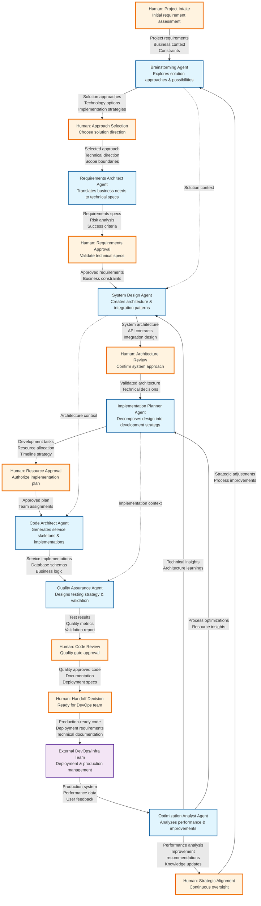

```mermaid
%%{init: {"theme": "default"}}%%
flowchart TD
    %% Agent Nodes
    BRAIN[Brainstorming Agent<br/>Explores solution approaches & possibilities]
    REQ[Requirements Architect Agent<br/>Translates business needs to technical specs]
    SYS[System Design Agent<br/>Creates architecture & integration patterns]
    PLAN[Implementation Planner Agent<br/>Decomposes design into development strategy]
    CODE[Code Architect Agent<br/>Generates service skeletons & implementations]
    QA[Quality Assurance Agent<br/>Designs testing strategy & validation]
    OPT[Optimization Analyst Agent<br/>Analyzes performance & improvements]
    
    %% Human Oversight Nodes
    H0[Human: Project Intake<br/>Initial requirement assessment]
    H1[Human: Approach Selection<br/>Choose solution direction]
    H2[Human: Requirements Approval<br/>Validate technical specs]
    H3[Human: Architecture Review<br/>Confirm system approach]
    H4[Human: Resource Approval<br/>Authorize implementation plan]
    H5[Human: Code Review<br/>Quality gate approval]
    H6[Human: Handoff Decision<br/>Ready for DevOps team]
    H7[Human: Strategic Alignment<br/>Continuous oversight]
    
    %% External Handoff
    EXT[External DevOps/Infra Team<br/>Deployment & production management]
    
    %% Flow Connections
    H0 -->|Project requirements<br/>Business context<br/>Constraints| BRAIN
    BRAIN -->|Solution approaches<br/>Technology options<br/>Implementation strategies| H1
    
    H1 -->|Selected approach<br/>Technical direction<br/>Scope boundaries| REQ
    REQ -->|Requirements specs<br/>Risk analysis<br/>Success criteria| H2
    
    H2 -->|Approved requirements<br/>Business constraints| SYS
    SYS -->|System architecture<br/>API contracts<br/>Integration design| H3
    
    H3 -->|Validated architecture<br/>Technical decisions| PLAN
    PLAN -->|Development tasks<br/>Resource allocation<br/>Timeline strategy| H4
    
    H4 -->|Approved plan<br/>Team assignments| CODE
    CODE -->|Service implementations<br/>Database schemas<br/>Business logic| QA
    
    QA -->|Test results<br/>Quality metrics<br/>Validation report| H5
    H5 -->|Quality approved code<br/>Documentation<br/>Deployment specs| H6
    
    H6 -->|Production-ready code<br/>Deployment requirements<br/>Technical documentation| EXT
    EXT -->|Production system<br/>Performance data<br/>User feedback| OPT
    
    OPT -->|Performance analysis<br/>Improvement recommendations<br/>Knowledge updates| H7
    
    %% Feedback Loops
    H7 -->|Strategic adjustments<br/>Process improvements| BRAIN
    OPT -->|Technical insights<br/>Architecture learnings| SYS
    OPT -->|Process optimizations<br/>Resource insights| PLAN
    
    %% Parallel Processing Connections
    BRAIN -.->|Solution context| SYS
    SYS -.->|Architecture context| CODE
    PLAN -.->|Implementation context| QA
    
    %% Styling
    classDef agent fill:#e1f5fe,stroke:#01579b,stroke-width:2px
    classDef human fill:#fff3e0,stroke:#ef6c00,stroke-width:3px
    classDef external fill:#f3e5f5,stroke:#4a148c,stroke-width:2px
    classDef feedback stroke-dasharray: 5 5
    
    class BRAIN,REQ,SYS,PLAN,CODE,QA,OPT agent
    class H0,H1,H2,H3,H4,H5,H6,H7 human
    class EXT external
```